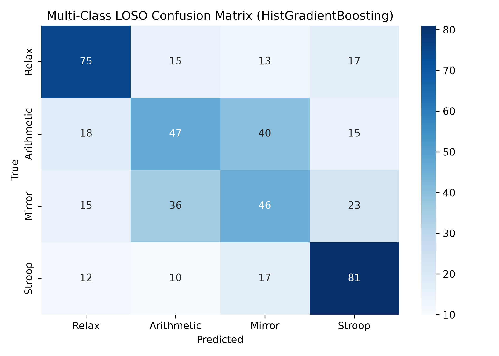

# EEG Stress Classification Pipeline (SAM40 Dataset)

Binary (Relax vs. Stress) and Multi-Class stress state classification from 32-channel EEG signals using Welch spectral band power extraction and Random Forest classification.

---

##  Methodology

1. **Signal Processing & Feature Extraction:**
   - **Pre-filtering:** Bandpass filtered between **0.5–45.0 Hz** with notch filtering at 50 Hz.
   - **Spectral Power:** Welch's power spectral density (PSD) computed across Delta ($\delta$), Theta ($\theta$), Alpha ($\alpha$), Beta ($\beta$), and Gamma ($\gamma$) bands.
   - **Physiological Biomarkers:** Extracted Frontal Alpha Asymmetry (FAA: $F3$ vs. $F4$) and Cross-Frequency Ratios ($\theta/\beta$, $\alpha/\beta$).
2. **Normalization & Model Training:**
   - Applied **Subject-Wise Relative Standard Scaling** to mitigate baseline inter-subject signal power variance.
   - Trained a **Random Forest Classifier** with 100 estimators.
3. **Cross-Validation Benchmark:**
   - Evaluated using **Leave-One-Subject-Out (LOSO)** cross-validation across all subjects to ensure robust cross-subject generalization.

---

##  Results

| Task | Evaluation Protocol | Accuracy | F1-Score | Baseline / Chance |
| :--- | :---: | :---: | :---: | :---: |
| **Binary Stress** *(Relax vs. Stress)* | **LOSO CV** | **82.71%** | **0.8940** | 50.0% |
| **Multi-Class** *(Relax, Arithmetic, Mirror, Stroop)* | **LOSO CV** | **51.88%** | **0.5120** | 25.0% |

*The pipeline achieves strong cross-subject generalization for binary stress detection, exceeding chance by over 32 percentage points under strict Leave-One-Subject-Out evaluation.*



---

##  Key Takeaways & Physiological Insights

- **Frontal Alpha Asymmetry (FAA):** Frontal alpha power shifts significantly between baseline relaxation and cognitive stress tasks (Mental Arithmetic, Stroop test).
- **Cross-Subject Robustness:** Subject-wise relative scaling effectively normalizes baseline individual power differences, allowing spectral features and ratios ($\theta/\beta$) to generalize across unseen subjects in LOSO evaluation.

---

##  Quick Start

1. **Activate Environment:**
   ```bash
   conda activate sam40
